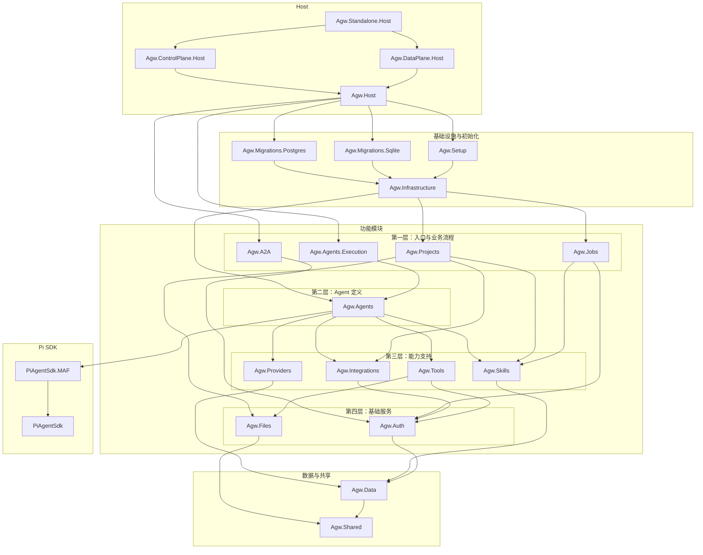

AGW 采用**基于领域的模块化单体**架构。`src/server/Agw.Host` 是共享的 Hosting Module，`Agw.Standalone.Host`、`Agw.ControlPlane.Host`、`Agw.DataPlane.Host` 是三个可执行的组合根。前端 `src/clients` 是 pnpm Workspace，包含 Web、Electron Desktop、Expo Mobile 以及共享业务和基础设施包。

## Application 层典型流程

Application 层负责用例与持久化。有领域规则时，Application 求值 Policy，并通过手动构造的 Behavior 应用纯数据 Decision；简单 CRUD 直接使用持久化接缝：

```text
Controller -> Application -> I<Module>DbContext / persistence adapter -> EF Core
```

## 模块依赖概览

后端与 Pi SDK 的简化依赖概览。省略 Contracts 项目及可以通过其他路径表达的重复引用；不包含测试项目与 NuGet 包。图从上到下排列，`A --> B` 表示 A 引用 B。



## 主要模块

| 模块 | 说明 |
| --- | --- |
| `Agw.Providers` | 管理模型及其供应商。 |
| `Agw.Agents` | 集成外部 Agent（Claude Code、Codex）和管理自定义 Agent。自定义 Agent 可集成 Tool、MCP、Skill。 |
| `Agw.Tools` | 内置 Tool 与 MCP Tool 管理模块。 |
| `Agw.Skills` | Skill 管理模块。 |
| `Agw.Integrations` | 外部 App 集成模块。 |
| `Agw.Projects` | Agent 对话历史与 Session 管理。AGW 中一个 Session 对应一个 Task，每个 Task 关联一个 Project。 |
| `Agw.Files` | 基于宿主机可见的本地 Workspace 提供项目级文件 API 与 Git 操作。 |
| `Agw.Jobs` | 定时、周期与一次性任务，支持 Cron 表达式。 |
| `Agw.A2A` | 对外提供 A2A 协议接口。 |
| `Agw.Auth` | 认证与授权基础服务。 |

## 三种组合根

<CardGroup cols={3}>
  <Card title="Standalone" icon="cube">
    单进程运行所有模块。默认使用 SQLite + InProcess 执行。
  </Card>
  <Card title="Control Plane" icon="sitemap">
    嵌入静态 Web UI，负责控制面 API。需要 PostgreSQL。
  </Card>
  <Card title="Data Plane" icon="database">
    只暴露 Execution、A2A 与健康检查路由。需要 PostgreSQL。
  </Card>
</CardGroup>

生产发布包含组合式 Standalone 镜像，以及独立的 Control Plane、Data Plane 镜像。拆分部署需先初始化 Control Plane，再启动 Data Plane。

## 前端 Workspace

`src/clients` 是 pnpm Workspace，包含独立的 `@agw/web`、`@agw/desktop`、`@agw/mobile` 应用，以及位于 `src/clients/packages/` 下的共享业务与基础设施包，由 Turborepo 编排任务：

- **Web 与 Desktop** 各自拥有独立的 Next.js 应用，不互相导入或消费对方的产物；业务与基础设施模块通过根目录下的 `packages/*` 复用。
- **Mobile** 只消费与 React Native 兼容的核心包。
- **Desktop** 在 `src/clients/desktop/` 下拥有独立的 Electron main/preload 实现和 React renderer；Renderer 复用与 Web 相同的业务包，Electron bridge contract 保留在 Desktop 内部。

## 进一步阅读

<CardGroup cols={2}>
  <Card title="部署" icon="server" href="/deployment">
    Docker、Standalone / Control Plane / Data Plane 打包与发布。
  </Card>
  <Card title="配置" icon="sliders" href="/configuration">
    数据库、执行模式、分布式锁与 OpenTelemetry。
  </Card>
</CardGroup>
