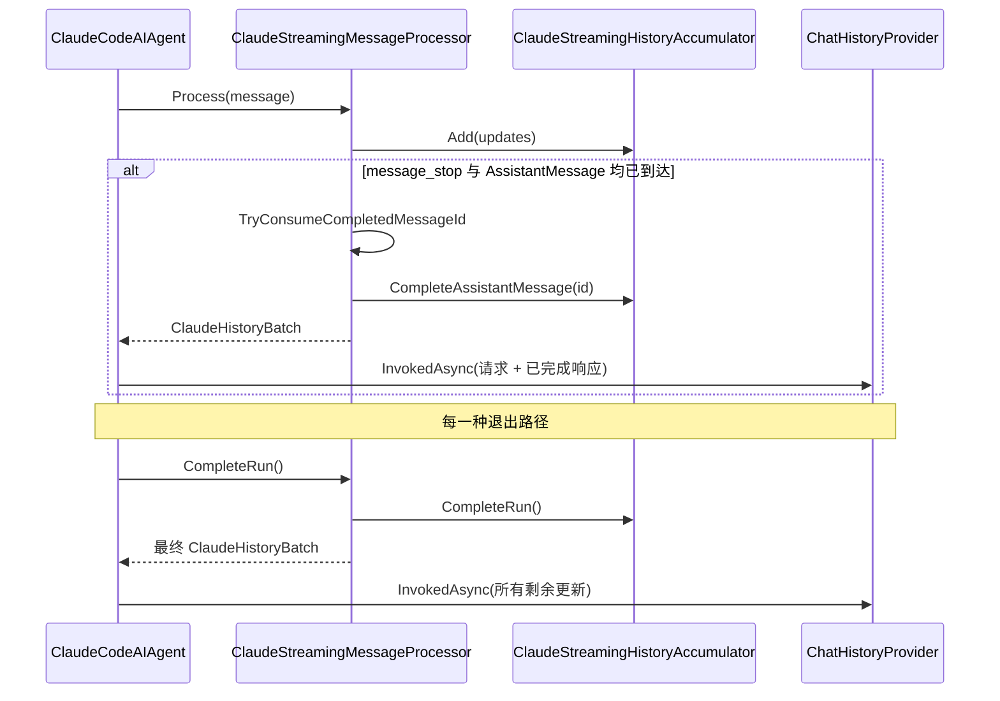

`ClaudeCodeAIAgentOptions.ChatHistoryProvider` 允许你插入自定义的对话历史存储（数据库、Redis、内存缓存等），MAF 集成会在合适的时机调用你的 hook。

## 触发时机

- `InvokingAsync(...)`：在请求发送**之前**执行。Claude Code 通过传入的 `AgentSession` ID 恢复模型历史，因此存储的消息**不会**被作为 prompt 重新发送。
- `InvokedAsync(...)`：只接收本次请求的新消息与响应消息。启用 partial 后，可能在一次 agent 运行中被多次调用：每条安全完成的 Assistant 消息一次，以及运行结束时的“最终收尾”一次。
- 当某条 Assistant 消息同时收到 `message_stop` 和完整的 `AssistantMessage` 后，它会被增量持久化。
- 无论是正常完成、失败、取消、上游异常，还是消费者提前释放，SDK 都会按原顺序持久化剩余的缓冲更新，包括未完成的文本和工具片段。
- 最终收尾的持久化会忽略运行的取消 token。如果流与最终持久化都失败，流的失败仍为主要异常。

## 配置示例

```csharp icon=code
using ClaudeCodeSdk.MAF;
using Microsoft.Agents.AI;
using Microsoft.Extensions.AI;

var options = new ClaudeCodeAIAgentOptions
{
    ChatHistoryProvider = new MyChatHistoryProvider(),
    SystemPrompt = "你是一名有用的编码助手。"
};

await using var agent = new ClaudeCodeAIAgent(options);
var session = await agent.CreateSessionAsync();

var response = await agent.RunAsync(
    [new ChatMessage(ChatRole.User, "延续我们之前的讨论。")],
    session: session
);
```

<Tip>
  向 `ChatHistoryProvider` 存储时保持传入相同的 `AgentSession`，以保留线程标识。
</Tip>

## 持久化流程



## RunAsync 与 RunStreamingAsync

- `RunAsync` 与 `RunStreamingAsync` 使用相同的完成／持久化状态机。
- 启用 partial 后，一次运行中包含多轮 Tool Use 时，`ChatHistoryProvider` 可能被多次调用，工具结果会随附到下一批完成的 Assistant 消息。
- 未启用 partial 时，历史保留“运行结束聚合”的兼容行为。

## 何时使用

<CardGroup cols={2}>
  <Card title="需要持久化完整对话" icon="database">
    将全部消息写入数据库或云存储，用于审计或搜索。
  </Card>

  <Card title="需要跨进程恢复对话" icon="clock-rotate-left">
    应用重启后能加载历史并继续 MAF 会话。
  </Card>
</CardGroup>

<Warning>
  `ChatHistoryProvider` 只负责应用侧的暂存历史；Claude Code 侧的模型历史通过 `AgentSession` 的 session ID 恢复，无需重复发送。
</Warning>
