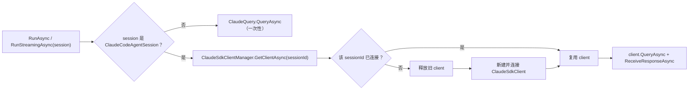

MAF 集成通过 `ClaudeCodeAgentSession` 维持对话上下文。每个会话持有一个 `SessionId`，映射到 Claude Code 侧的会话持久化，因此多轮对话可以在同一会话内保留上下文。

## 创建并复用会话

```csharp icon=code
using ClaudeCodeSdk.MAF;
using Microsoft.Extensions.AI;

await using var agent = new ClaudeCodeAIAgent();

var session = await agent.CreateSessionAsync();

// 第一轮
var response1 = await agent.RunAsync(
    [new ChatMessage(ChatRole.User, "什么是依赖注入？")],
    session: session
);

// 第二轮，通过 session 保留上下文
var response2 = await agent.RunAsync(
    [new ChatMessage(ChatRole.User, "在 C# 中给我一个例子")],
    session: session
);
```

<Tip>
  只要向所有 `RunAsync`／`RunStreamingAsync` 调用传入同一个 `session` 对象，上下文就会被保留。
</Tip>

## 会话持久化

`ClaudeCodeAgentSession` 支持序列化与反序列化，可以将其存入数据库或文件，之后恢复继续对话：

```csharp icon=code
using System.Text.Json;
using ClaudeCodeSdk.MAF;
using Microsoft.Extensions.AI;

await using var agent = new ClaudeCodeAIAgent();
var session = await agent.CreateSessionAsync();

await agent.RunAsync([new ChatMessage(ChatRole.User, "你好！")], session: session);

// 序列化会话
var serialized = await agent.SerializeSessionAsync(session);
var json = JsonSerializer.Serialize(serialized);
// 保存 json 到数据库或文件…

// 稍后：反序列化并继续
var restored = JsonSerializer.Deserialize<JsonElement>(json);
var restoredSession = await agent.DeserializeSessionAsync(restored);

var response = await agent.RunAsync(
    [new ChatMessage(ChatRole.User, "我们刚才聊了什么？")],
    session: restoredSession
);
```

## 会话与客户端生命周期

MAF 集成按调用选择传输方式：

- 没有传入 `ClaudeCodeAgentSession`（或传入其它类型）时，使用一次性的 `ClaudeQuery.QueryAsync`。
- 传入真实会话时，通过 `ClaudeSdkClientManager` 复用已连接的 `ClaudeSdkClient`。切换会话 ID 时会释放旧客户端并重新连接。



## 使用建议

<Warning>
  每次调用都必须传入相同的 `AgentSession` 对象才能维持对话上下文；创建新的 `AgentSession` 会开启一段新的对话。
</Warning>

- 序列化只保留 `SessionId`。真正的模型历史由 Claude Code 通过 session ID 恢复。
- 如需将应用侧的完整历史写入自有存储，请配合 [Chat History Provider](/maf-sdks/chat-history) 使用。
