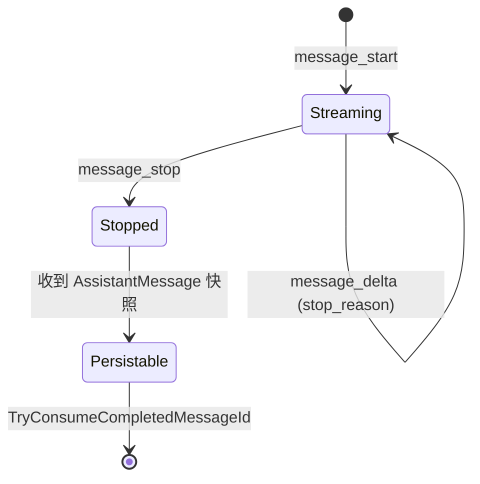

MAF 集成通过 `RunStreamingAsync` 返回 `AgentResponseUpdate` 流。启用 `IncludePartialMessages` 后，SDK 会将 CLI 的原始 `stream_event` 转换为标准的 MAF 增量事件。

## 基本流式调用

```csharp icon=code
using ClaudeCodeSdk.MAF;
using Microsoft.Extensions.AI;

await using var agent = new ClaudeCodeAIAgent();

await foreach (var update in agent.RunStreamingAsync("讲一个关于编程的故事"))
{
    if (update.Contents is null) continue;
    foreach (var content in update.Contents)
    {
        if (content is TextContent text) Console.Write(text.Text);
    }
}
```

## 启用 Partial 消息

设置 `IncludePartialMessages = true` 后，文本与思考的增量会立即发出，且 `ResponseId` 与 `MessageId` 保持稳定；`ToolUse` 的 JSON 会在内部累积，等对应内容块结束时作为完整的 `FunctionCallContent` 发出。

```csharp icon=code
var options = new ClaudeCodeAIAgentOptions
{
    IncludePartialMessages = true,
    SystemPrompt = "你是一名 C# 专家。"
};

await using var agent = new ClaudeCodeAIAgent(options);

await foreach (var update in agent.RunStreamingAsync("解释 async/await"))
{
    if (update.Contents is null) continue;
    foreach (var content in update.Contents)
    {
        switch (content)
        {
            case TextContent text:
                Console.Write(text.Text);
                break;
            case TextReasoningContent reasoning:
                Console.WriteLine($"[思考] {reasoning.Text}");
                break;
            case FunctionCallContent call:
                Console.WriteLine($"[工具] {call.Name}");
                break;
            case FunctionResultContent result:
                Console.WriteLine($"[结果] {result.Result}");
                break;
        }
    }
}
```

<Note>
  未启用 `IncludePartialMessages` 时，SDK 使用向后兼容的“运行结束聚合”策略，仍能通过 `RunStreamingAsync` 获取多个更新，但粒度较粗。
</Note>

## 一次助手消息的状态机

启用 partial 时，单条助手消息经历如下状态：



只有当 `message_stop` 与完整的 `AssistantMessage` **都**到达时，该消息才可增量持久化。已通过增量流出的内容块通过 `EmittedContentIndexes` 去重，避免重复发出。

## 内容类型映射

| Claude 内容块 | MAF `AIContent` 类型 |
| --- | --- |
| `TextBlock` | `TextContent` |
| `ThinkingBlock` | `TextReasoningContent` |
| `ToolUseBlock` | `FunctionCallContent` |
| `ToolResultBlock` | `FunctionResultContent` |
| `ErrorContentBlock` | `ErrorContent` |

## Usage 与成本

即使使用流式模式，最终的 `AgentResponse` 仍可通过 `Usage` 属性读取 token 使用情况：

```csharp icon=code
var response = await agent.RunAsync("解释递归");

if (response.Usage is not null)
{
    Console.WriteLine($"输入 tokens: {response.Usage.InputTokenCount}");
    Console.WriteLine($"输出 tokens: {response.Usage.OutputTokenCount}");
    Console.WriteLine($"缓存 tokens: {response.Usage.CachedInputTokenCount}");
}
```
