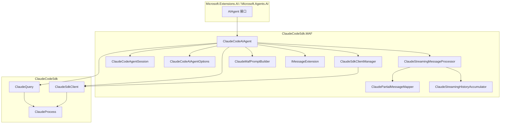
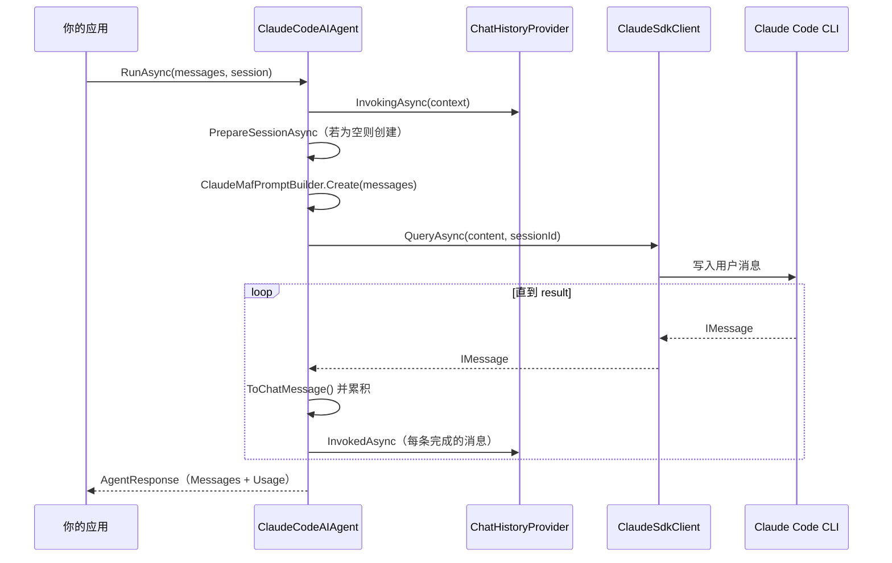
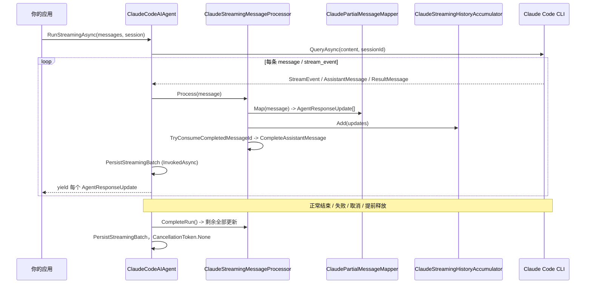

Claude Code SDK for C# 采用双模式架构：核心的 `ClaudeProcess` 统一管理与 Claude Code CLI 的进程通信，`ClaudeQuery` 与 `ClaudeSdkClient` 在其上提供不同的调用模式。MAF 集成在此基础上适配 `AIAgent` 契约。

## 分层示意

## 非流式 Run 流程

`RunAsync` 收集完整对话并返回单个 `AgentResponse`。配置了 `ChatHistoryProvider` 时，内部仍会运行流式状态机，以便对完成的消息增量持久化。

## 流式管道

`RunStreamingAsync` 会在增量到达时逐个 yield `AgentResponseUpdate`。处理器把每条 `IMessage` 送入映射器，在 yield 之前先持久化完成的 Assistant 批次，并在运行退出时统一在 `finally` 中排空剩余更新。

## 消息终止行为

- `ClaudeProcess.ReceiveAsync()` 在没有待处理委派 agent 的 result 或错误 result 出现时终止。
- `local_agent` 与 `local_workflow` 委派任务通过 `task_started`、`task_notification` 与终态 `task_updated` 追踪；所有 result 按顺序转发，中间 result **不会**中止枚举。
- MAF 只要求最终成功 result 具备结构化输出，中间 result 可以是纯文本。
- 若 CLI 在发出较早一轮 result 之前就上报所有任务完成，SDK 无法感知仍有后续待处理。
- 取消 token 可中断等待；等待最终 result 时遇到 EOF 会抛 `ProcessException`。

## 资源管理

所有管理进程的类都实现 `IAsyncDisposable`：

- `ClaudeProcess` 负责子进程 start／kill／cleanup。
- 使用 `await using` 保证自动清理。
- `ClaudeSdkClientManager` 在切换会话时释放旧客户端。
